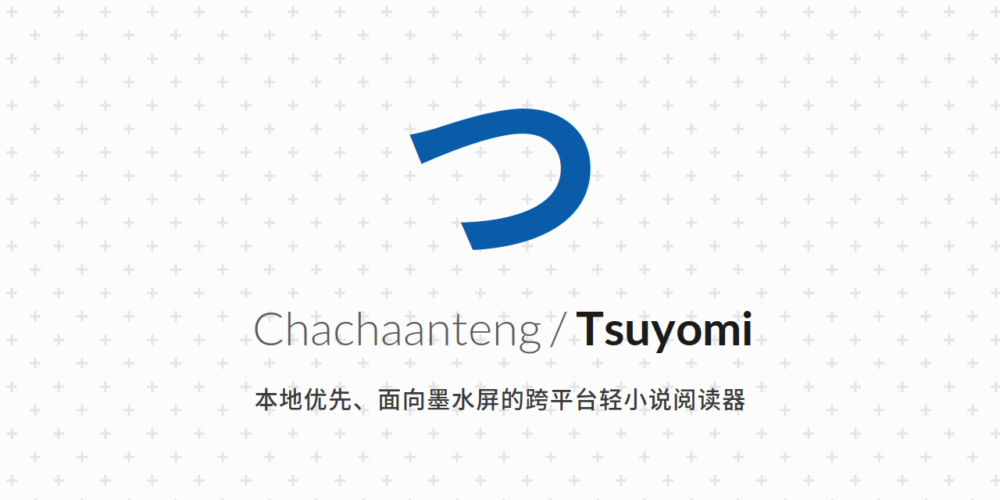

# Tsuyomi-iOS
<p align="center">
  
</p>

<p align="center">
  
  <a href="LICENSE"></a>
  
</p>

---

## 简介

Tsuyomi 是一款本地优先的跨平台轻小说阅读器，这里是它的 **iOS 客户端**。它用 Swift / SwiftUI 原生实现，
消费与 Android 端相同的 `tsuyomi-protocol` 契约和同一批签名的 `.hxp` 扩展包，而不是移植 Android 的代码。

墨水屏相关的设备类别（DisplayProfile、E-ink 重绘、音量键翻页）在 iOS 上没有对应硬件，整族已删除，
不保留枚举、偏好或占位入口。

## 不变量

- **本地优先**：没有账号、没有使用统计、没有远程开关、没有崩溃上报、没有 iCloud 同步。
- **来源隔离**：来源逻辑只存在于签名扩展里；宿主拥有网络、Cookie、WebView、存储、资源上限与诊断脱敏，
  扩展拿不到任何 Foundation/UIKit 对象。仓库里不存在按站点命名的宿主代码。
- **语义化进度**：进度记录段落 ID、文本锚点摘要与码点偏移，不记录页码、像素或滚动比例。
- **用户介导验证**：登录与人工验证由你在受控的 `WKWebView` 中手动完成；不实现任何 CAPTCHA / Cloudflare
  自动绕过，关闭窗口不触发任何远端写入。
- **`加入书架` 无条件仅本地**：网站收藏是只读拉取，复制到本地不会在站点上新增任何内容。

## 构建

需要 Xcode 16.4 或更新版本，部署目标 iOS 16.4，Swift 6 语言模式 + `-strict-concurrency=complete`。

```bash
# 包级构建与测试（模拟器）
xcodebuild test -scheme Tsuyomi-Package -destination 'platform=iOS Simulator,name=iPhone 16'

# App target
xcodebuild build -project App/Tsuyomi.xcodeproj -scheme Tsuyomi \
  -destination 'platform=iOS Simulator,name=iPhone 16'
```

零第三方依赖。QuickJS-ng 以源码形式内嵌在 `Sources/CQuickJS/quickjs-ng/`（逐字复制、永不手改），
不是 SwiftPM 依赖；见 [`THIRD_PARTY_NOTICES.md`](THIRD_PARTY_NOTICES.md)。

## 模块

| 模块 | 职责 |
|---|---|
| `TsuyomiProtocol` | 协议契约：locator、reader document、source contract、smart rule、transfer；无平台依赖 |
| `TsuyomiCore` | 宿主基础：SQLite v4、文件配额、偏好、凭据、网络网关、封面 |
| `CQuickJS` | 内嵌的 QuickJS-ng 与桥接层 |
| `TsuyomiSource` | HXP 校验/安装、运行时通道、来源客户端、扩展仓库 |
| `TsuyomiReader` | 阅读引擎与 TextKit 2 排版 |
| `TsuyomiUI` | 语义组件与设计令牌 |
| `*Feature` | 各屏幕与其 model |
| `TsuyomiApp` | 组合根、路由、跨屏协调 |

## 文档

- [`docs/DECISIONS.md`](docs/DECISIONS.md) — 文档未规定处的每一条决策
- [`docs/ACCEPTANCE.md`](docs/ACCEPTANCE.md) — 各里程碑验收门与结果
- [`docs/OPTION_APPLICABILITY_IOS.md`](docs/OPTION_APPLICABILITY_IOS.md) — 每个设置项为什么可见、何时生效

## 许可

AGPL-3.0-only。
